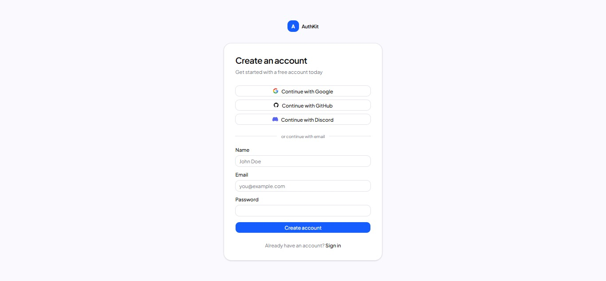
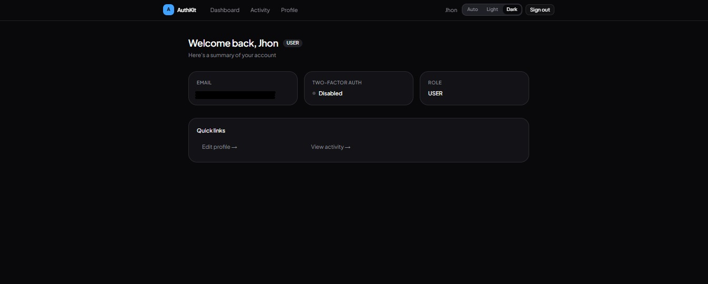
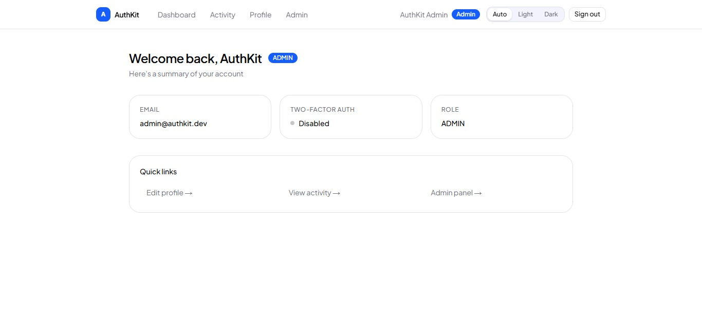
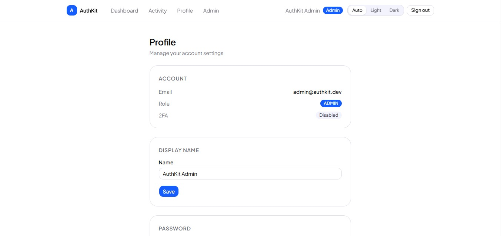

# AuthKit

> Production-ready Next.js authentication starter. Everything you need to add secure, full-featured auth to your SaaS — built, tested, and ready to ship.

[](https://authkit.vercel.app)

---

## Preview

| Login | Dashboard |
|---|---|
|  |  |

| Admin panel | Profile & 2FA |
|---|---|
|  |  |

---

## Why AuthKit?

Most auth tutorials give you a login form. AuthKit gives you everything that comes after:

- **2FA with TOTP** — Google Authenticator, Authy, 1Password — with 8 recovery codes
- **Audit log** — every auth event tracked with IP, browser, OS, and geolocation
- **Admin impersonation** — sign in as any user to debug issues; red banner + one-click exit
- **Account lockout** — 10 failed attempts → 30-minute lockout, auto-reset on success
- **Rate limiting** — login (5/15 min) and password reset (3/hour) via Upstash Redis
- **Demo mode** — full flow works without Resend or any third-party service configured

---

## Features

### Authentication
- **Credentials** — Email + password with bcrypt hashing
- **OAuth** — Google, GitHub, and Discord (add any NextAuth provider in minutes)
- **Email verification** — Double opt-in via Resend
- **Password reset** — Token-based, expires in 2 hours
- **Demo mode** — Works without a Resend key (auto-verifies accounts)

### Security
- **Two-factor authentication** — TOTP via Google Authenticator, Authy, or 1Password
- **Recovery codes** — 8 one-time codes generated on 2FA setup
- **Rate limiting** — 5 login attempts per 15 min + 3 password reset requests per hour via Upstash Redis
- **Account lockout** — 10 failed attempts → 30-minute lockout, auto-reset on success
- **New location alert** — Email notification when login detected from a new country
- **Case-insensitive email** — `Juan@Gmail.com` and `juan@gmail.com` are the same account
- **Route protection** — `proxy.ts` guards all protected routes by role

### Sessions & Audit
- **Audit log** — Every auth event logged with IP, browser, OS, and geolocation
- **Activity page** — Users see their own login history
- **Sign out all devices** — Invalidates all active sessions at once

### Admin Panel
- **User management** — View all users with role, verification, and 2FA status
- **Impersonation** — Sign in as any user to debug issues; red banner + one-click exit
- **CSV export** — Download the full audit log as a spreadsheet

### Onboarding
- **Post-registration wizard** — 2-step flow to collect the user's display name
- **Automatic redirect** — New users land on `/onboarding` before the dashboard

### Developer Experience
- **Interactive docs** — `/docs` page inside the app explains every feature and file
- **Role-based access** — `ADMIN` / `USER` roles enforced at proxy and page level
- **Dark mode** — Segmented control: Auto / Light / Dark
- **Responsive** — Mobile-first layout throughout

---

## Stack

| | |
|---|---|
| Framework | Next.js 16 + React 19 |
| Language | TypeScript 5 |
| Auth | NextAuth v5 (beta) |
| Database | PostgreSQL via Prisma 6 |
| UI | shadcn/ui + Tailwind CSS 4 |
| Email | Resend |
| Rate limiting | Upstash Redis |
| 2FA | otpauth + qrcode |
| Fonts | Plus Jakarta Sans |

---

## Quick start

```bash
git clone https://github.com/YulianaGP/authkit.git
cd authkit
npm install
cp .env.example .env.local
# fill in .env.local
npx prisma db push
npx prisma db seed
npm run dev
```

See [SETUP.md](./SETUP.md) for the full step-by-step guide including OAuth setup, email configuration, and Vercel deployment.

---

## Environment Variables

```env
# Database (Neon PostgreSQL)
DATABASE_URL=""
DATABASE_URL_UNPOOLED=""

# NextAuth
AUTH_SECRET=""            # openssl rand -hex 32
AUTH_URL=""               # http://localhost:3000 in dev

# OAuth — remove providers you don't need
AUTH_GOOGLE_ID=""
AUTH_GOOGLE_SECRET=""
AUTH_GITHUB_ID=""
AUTH_GITHUB_SECRET=""
AUTH_DISCORD_ID=""
AUTH_DISCORD_SECRET=""

# Resend — leave empty to run in demo mode (auto-verifies accounts)
RESEND_API_KEY=""
RESEND_FROM_EMAIL=""

# Upstash Redis — required for rate limiting
UPSTASH_REDIS_REST_URL=""
UPSTASH_REDIS_REST_TOKEN=""
```

> Full setup guide in [SETUP.md](./SETUP.md).

---

## Project structure

```
src/
├── app/
│   ├── (auth)/          # Login, register, verify-email, reset-password, 2FA
│   ├── (protected)/     # Dashboard, profile, sessions, admin, onboarding
│   ├── docs/            # Interactive documentation
│   └── page.tsx         # Landing page
├── actions/             # Server Actions
├── components/          # UI components
├── lib/                 # Utilities (db, mail, tokens, audit, 2FA, rate-limit)
└── auth.ts              # NextAuth v5 config
prisma/
├── schema.prisma
└── seed.ts
```

---

## Key files

| File | Purpose |
|---|---|
| `src/auth.ts` | NextAuth config — providers, JWT callbacks, impersonation |
| `src/proxy.ts` | Route protection (Next.js 16 middleware equivalent) |
| `src/actions/auth.ts` | register, login, logout, forgotPassword, resetPassword, verifyEmail |
| `src/actions/two-factor.ts` | 2FA setup, enable, disable, verify, complete login |
| `src/actions/impersonate.ts` | Admin impersonation start/stop |
| `src/lib/audit.ts` | Audit log creation with geo + device detection |
| `src/lib/mail.ts` | Email templates via Resend |
| `prisma/schema.prisma` | Full database schema |

---

## Next.js 16 notes

This template targets **Next.js 16** which has breaking changes from Next.js 14/15:

- `middleware.ts` is renamed to `proxy.ts` with a `proxy` export
- `cookies()`, `headers()`, `params`, `searchParams` are all async
- Turbopack is the default bundler

---

## License

MIT — see [LICENSE](./LICENSE)
